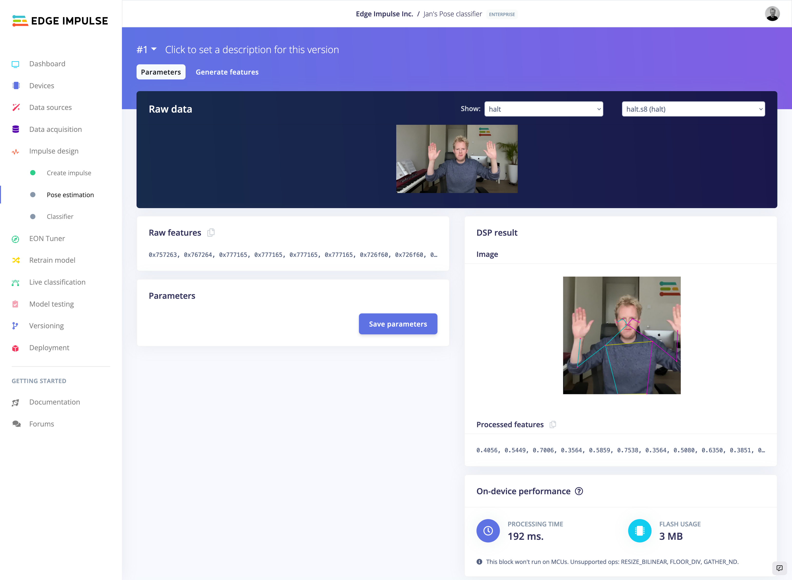
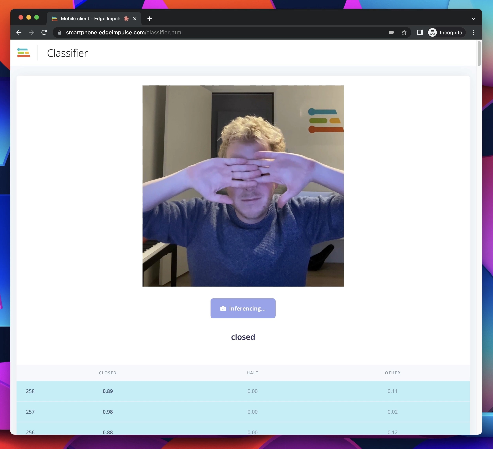

# Pose estimation processing block

This implements a pose estimation [processing block](https://docs.edgeimpulse.com/docs/custom-blocks) based on [PoseNet](https://github.com/tensorflow/tfjs-models/tree/master/pose-detection) in Edge Impulse. Use this block to turn raw images into pose vectors, then pair it with an ML block to detect what a person is doing.

## How to run this block (locally)

1. Docker:
    1. Build the container:

        ```
        $ docker build -t edge-detection-block .
        ```

    1. Run the block:

        ```
        $ docker run -p 4449:4449 -it --rm  edge-detection-block
        ```

1. Install [ngrok](https://ngrok.com) and open up port 4449 to the world:

    ```
    $ ngrok http 4449
    ```

    Note down the 'Forwarding' address that starts with https, e.g.:

    ```
    Forwarding                    https://4e9e1e61e3aa.ngrok.io -> http://localhost:4449
    ```

1. In Edge Impulse, go to **Create impulse**, then:
    1. Set the image width / height to 192 x 192 (this is the only resolution that works).
    1. click *Add a processing block*, click *Add custom block* and enter the URL from the previous step.
    1. Click *Add a learning block*, click *Classification*.
    1. Click *Save impulse*.
1. You now have pose estimation as a preprocessing block:

    

1. Train your model as usual 🚀

## How to run this block (hosted in Edge Impulse)

Note: this flow is only available for enterprise customers.

1. Init the DSP block via:

    ```
    $ edge-impulse-blocks init
    ```

1. Push the block via:

    ```
    $ edge-impulse-blocks push
    ```

1. In Edge Impulse open a project owned by your organization, go to **Create impulse**, then:
    1. Set the image width / height to 192 x 192 (this is the only resolution that works).
    1. click *Add a processing block*, select the block.
    1. Click *Add a learning block*, click *Classification*.
    1. Click *Save impulse*.

1. Follow the steps above!

## Running on device

This block will run on Linux devices as-is. Just deploy as usual from the Studio.



### Updating the model

Due to the size of the model and some unsupported ops it won't work on MCU in its current form. If you decide to train a smaller custom model, you'll need to replace `model.tflite`. You'll get feedback on the model through the 'On-device performance widget' in the Studio:


